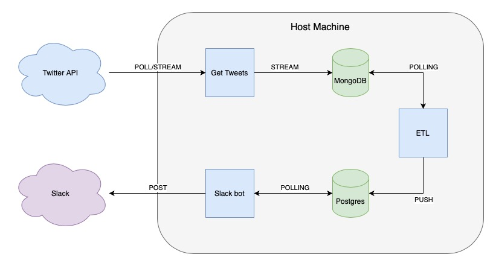

# Sentiment-Slack-Bot-ETL-Pipeline

An entire ETL pipeline which obtains tweets to carry out dictionary based sentimental analysis to publish messages to slack channels 🐦

## Architecture

- The three blue docker containers each have a single responsibility 
- Unstructured raw data is pulled in from twitter and loaded into the MongoDB database
- The ETL job container gives the data structure and puts it into the Postgres database
- The Slack bot container analyzes the sentiment and sends a message to a slack channel
